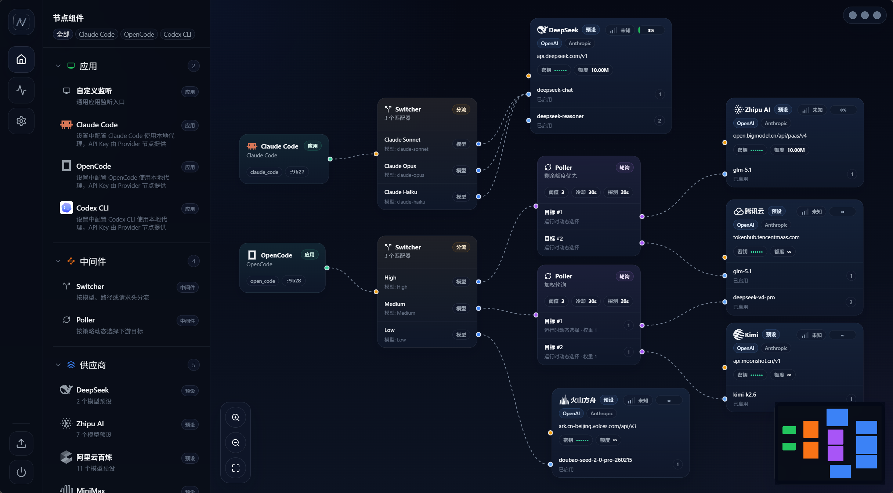

<p align="center">
  
</p>

<h1 align="center">AAStation</h1>

<p align="center">
  <strong>本地 AI API 代理工具</strong>
</p>

<p align="center">
  画个图，把 AI 请求转发到你想用的供应商
</p>

<br>

<p align="center">
  <a href="https://github.com/QinMoXX/AAStation/releases">
    
  </a>
  
  
</p>

<p align="center">
  <a href="#安装使用">安装使用</a> · <a href="#english">English</a>
</p>

---

**简体中文**

## 它解决什么问题？

你在本地用 Claude Code、OpenCode、Codex CLI 这类工具时，请求只能走一个供应商。如果你想：

- 让 Claude Code 用 DeepSeek 或智谱的模型
- 同时接入多个供应商，挂了一个自动切到另一个
- 按模型名、路径等条件把请求分发给不同的服务

<br>

<p align="center">
  
</p>

<br>

## 怎么做到的

你在画布上拖拽四种节点，连成一条链路，代理就按这条链路转发请求：

| 节点 | 作用 |
|------|------|
| **应用 (Application)** | 代表一个客户端工具，每个应用监听一个独立端口 |
| **路由器 (Switcher)** | 按条件分发请求（模型名、路径、请求头） |
| **分配器 (Poller)** | 在多个供应商中自动选择（按权重 / 健康状态 / 额度余量） |
| **供应商 (Provider)** | 一个 AI 服务端点，配好 API Key 即可使用 |

最简单的链路只需要 **应用 → 供应商** 两步。

<br>

## 主要特性

- **可视化配置** — 拖拽连线搭建请求链路，不需要写配置文件
- **智能切换** — 供应商故障时自动切换，支持权重、健康优先、额度余量等策略
- **一键配置客户端** — 自动写入 Claude Code、OpenCode、Codex CLI 的代理设置
- **实时监控** — 请求数、Token 用量、延迟、成功率一目了然
- **供应商健康状态** — 正常 / 降级 / 熔断 / 半开，状态持久化
- **系统托盘** — 后台运行，支持开机自启
- **自动更新** — 启动时检查，一键安装新版本

<br>

## 内置供应商预设

开箱即用，填上 API Key 就能连：

DeepSeek · 智谱 AI · 阿里云百炼 · MiniMax · Kimi · 火山方舟 · OpenRouter · 腾讯云 · 讯飞 Coding Plan

也支持自定义供应商，填写 Base URL 和模型即可。

<br>

## 常用客户端一键配置

添加Claude Code、OpenCod、Codex CLI 应用节点后，设置界面点击"写入配置" 一键配置。

> **Codex CLI 注意**：AAStation 不支持修改旧版 Codex 配置；新版 Codex 改用 Responses API，兼容性有限。建议优先使用 **Claude Code** 或 **OpenCode**。（详见 [Codex 官方说明](https://github.com/openai/codex/discussions/7782)）。

<br>

## 安装使用

<br>

### 直接安装

从 [Releases](https://github.com/QinMoXX/AAStation/releases) 下载安装包，安装后打开。

<br>

### 从源码构建

> 前置条件：[Node.js](https://nodejs.org/) v18+、[Rust](https://www.rust-lang.org/tools/install)、[Visual Studio Build Tools](https://visualstudio.microsoft.com/visual-cpp-build-tools/)（Windows 需安装"桌面开发"工作负载）

```bash
git clone https://github.com/QinMoXX/AAStation.git
cd AAStation
npm install
npm run tauri dev    # 开发模式
npm run tauri build  # 构建安装包
```

<br>

## 使用步骤

1. **添加供应商** — 左侧加号选择供应商，填入 API Key
2. **添加应用** — 添加一个应用节点，选择客户端类型（Claude Code / OpenCode / Codex CLI / 通用）
3. **连线** — 从应用拖向供应商，中间可加路由器或分配器
4. **启动代理** — 保存后点击"开启代理"
5. **配置客户端** — 设置 → 应用设置，选择客户端和应用节点，点击"写入配置"
6. **开始使用** — 客户端正常使用即可，请求自动经过代理转发

### 常见链路示例

**直连一个供应商**
```
通用应用 → DeepSeek
```

<br>

**按模型分流**
```
Claude Code → 路由器 → DeepSeek
                    → 智谱 AI
```

<br>

**多供应商自动切换**
```
OpenCode → 分配器 → DeepSeek
                  → 腾讯云
                  → 火山方舟
```

---

<a name="english"></a>

<br>

## English

### What problem does it solve?

When you use tools like Claude Code, OpenCode, or Codex CLI locally, your requests can only go to one provider. What if you want to:

- Use DeepSeek or Zhipu models with Claude Code
- Connect multiple providers and auto-switch when one goes down
- Route requests to different services based on model name, path, or headers

AAStation runs a **local proxy server** that forwards your AI API requests according to rules you define visually.

<br>

### How it works

You drag four types of nodes on a canvas and connect them into a pipeline. The proxy forwards requests along that pipeline:

| Node | Purpose |
|------|---------|
| **Application** | Represents a client tool, each listening on its own port |
| **Switcher** | Routes requests by conditions (model name, path, headers) |
| **Poller** | Picks the best provider (by weight / health / remaining quota) |
| **Provider** | An AI service endpoint — add your API Key and go |

The simplest pipeline is just **Application → Provider**.

<br>

### Features

- **Visual configuration** — Drag and connect to build request pipelines, no config files needed
- **Smart failover** — Auto-switches providers on failure, with weight/health/quota strategies
- **One-click client setup** — Auto-writes proxy config for Claude Code, OpenCode, and Codex CLI
- **Real-time monitoring** — Request count, token usage, latency, success rate at a glance
- **Provider health status** — Normal / degraded / circuit-break / half-open, persisted across restarts
- **System tray** — Runs in background, supports auto-start
- **Auto-update** — Checks on startup, one-click install

<br>

### Built-in Provider Presets

Ready to use — just add your API Key:

DeepSeek · Zhipu AI · Alibaba Bailian · MiniMax · Kimi · Volcengine Ark · OpenRouter · Tencent Cloud · iFlytek Coding Plan

Custom providers are also supported — just fill in the Base URL and models.

<br>

### Install

Download the installer from [Releases](https://github.com/QinMoXX/AAStation/releases).

<br>

### Build from Source

> Prerequisites: [Node.js](https://nodejs.org/) v18+, [Rust](https://www.rust-lang.org/tools/install), [Visual Studio Build Tools](https://visualstudio.microsoft.com/visual-cpp-build-tools/) (Windows, "Desktop development" workload)

```bash
git clone https://github.com/QinMoXX/AAStation.git
cd AAStation
npm install
npm run tauri dev    # Dev mode
npm run tauri build  # Build installer
```

<br>

### Quick Start

1. **Add a provider** — Select from presets, enter your API Key
2. **Add an application** — Choose client type (Claude Code / OpenCode / Codex CLI / Generic)
3. **Connect** — Drag from application to provider; add Switcher or Poller in between if needed
4. **Start proxy** — Save and click "Start Proxy"
5. **Configure client** — Settings → Apps, select your client and application node, click "Write Config"
6. **Done** — Use your client as usual; requests go through the proxy automatically

